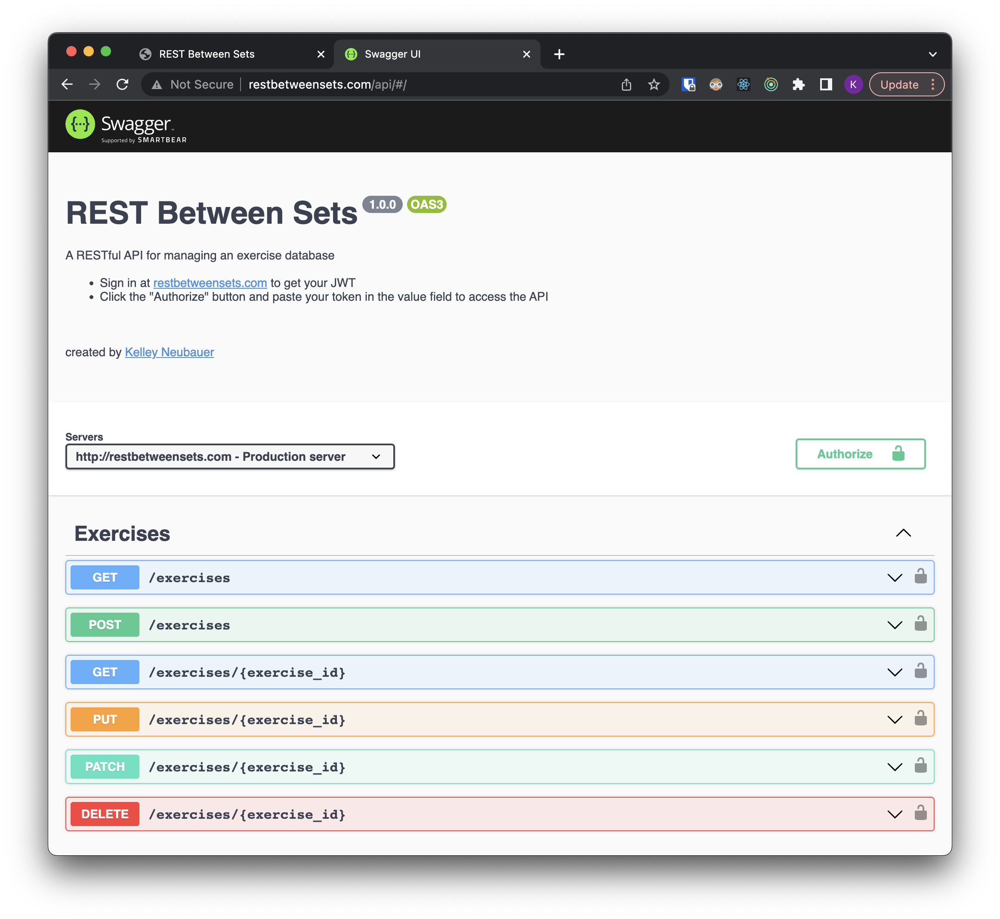

# REST Between Sets
[REST Between Sets](http://www.restbetweensets.com) is a RESTful API for an exercise library that allows users to contribute to a shared database.

The API supports CRUD operations for two entities: Exercises and Movements. 

- Exercises are various physical activities i.e. Barbell Back Squat. 
- Movements are used to categorize exercises into broad movement categories i.e. Squat.
- Exercises & Movements can be viewed by all users but can only modified by the creating user.

<u>How to use:</u>

- Register at [restbetweensets.com](http://restbetweensets.com) and sign in to get a JWT.
- Make HTTP requests with the Authorization header set to "Bearer \<JWT\>".
  - Or simply use the [Swagger UI](http://restbetweensets.com/api) with your \<JWT\> for authorization.

Visit [http://restbetweensets.com/api](http://restbetweensets.com/api) for documentation and usage.

